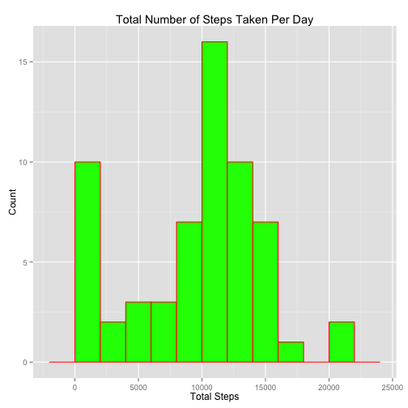
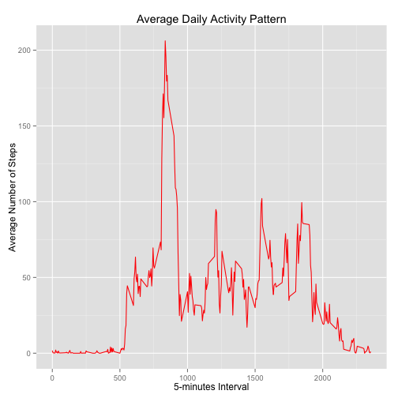
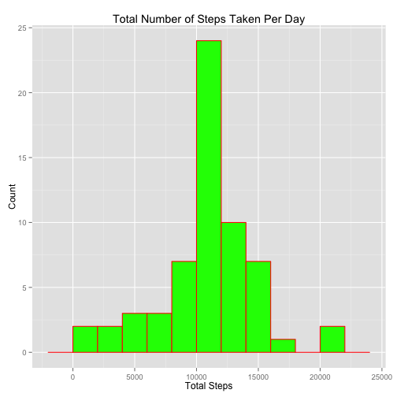
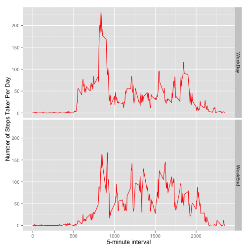

## Introduction

To what extent does the time of the day affect our daily movement? Are we more active in the morning or in the afternoon? Are we more active during weekdays or weekend? These are some of the possible questions we can pose, and the answers might be obvious ones. With the advent of wearable apps in phones and wearable devices available to growing number of people, there is also opportunity to quantify observations about a persons' daily movement. Using the data collected from these devices and a statistical software such as R, one can perform quantitative analysis to provide evidence to answers and claims about the factor of time in a person's daily movement.

In this peer assessment task we aim to explore data collected from an activity monitoring device, which records the number of steps taken by a person wearing the device. Specifically, we will try to find out how many number of steps does a person take in day, and how much does it varies with respect to time and day. We will attempt to carry out an exploratory data analysis to find some pattern in the data, and ultimately, if we can extract useful information about a person's daily movement. 

                                                                                                               
## Data

The data is collected by an activity monitoring device(Fitbit, Nike FuelBand, or Jawbone Up). The device recorded the number of steps in a 5-minute interval throughout the day for two months, October and November 2012. The variables in the data set are:

- steps: Numbers of steps taken in a 5 minute interval, missing values appear as NA

- date: The date on which the measurement was taken YYYY-MM-DD formate

- interval: Identifier for the 5 minute interval 

The first step is to get and extract the data from a source, [Activity Monitoring Data](https://d396qusza40orc.cloudfront.net/repdata%2Fdata%2Factivity.zip).  

Below is the chunk of code that takes care of this. Note that the code is commented, and one can uncomment it if needed.


```r
#dataset_url <- "https://d396qusza40orc.cloudfront.net/repdata%2Fdata%2Factivity.zip"
#download.file(dataset_url, "repdata-data-activity.zip",method="curl")
#dateDownloaded <- date()
#unzip("repdata-data-activity.zip")
```

## Loading and preprocessing the data

We now load the data into R, our software of choice for the data analysis. We use read.csv to load the data into a dataset name activityData.


```r
activityData <- read.csv("activity.csv")
head(activityData)  # to have a glimpse of the data
```

```
##   steps       date interval
## 1    NA 2012-10-01        0
## 2    NA 2012-10-01        5
## 3    NA 2012-10-01       10
## 4    NA 2012-10-01       15
## 5    NA 2012-10-01       20
## 6    NA 2012-10-01       25
```

```r
str(activityData)   # to get more information about the data 
```

```
## 'data.frame':	17568 obs. of  3 variables:
##  $ steps   : int  NA NA NA NA NA NA NA NA NA NA ...
##  $ date    : Factor w/ 61 levels "2012-10-01","2012-10-02",..: 1 1 1 1 1 1 1 1 1 1 ...
##  $ interval: int  0 5 10 15 20 25 30 35 40 45 ...
```

```r
summary(activityData) # to get more statistical information about the data
```

```
##      steps                date          interval     
##  Min.   :  0.00   2012-10-01:  288   Min.   :   0.0  
##  1st Qu.:  0.00   2012-10-02:  288   1st Qu.: 588.8  
##  Median :  0.00   2012-10-03:  288   Median :1177.5  
##  Mean   : 37.38   2012-10-04:  288   Mean   :1177.5  
##  3rd Qu.: 12.00   2012-10-05:  288   3rd Qu.:1766.2  
##  Max.   :806.00   2012-10-06:  288   Max.   :2355.0  
##  NA's   :2304     (Other)   :15840
```

As soon as we have loaded the data properly and check that we have all the expected variables in the dataset, we can perform preprocessing to make the data more appropriate for our statistical analysis. In the chunk of code below, we rename the variables. We also convert the date into data type date.


```r
Step <- activityData$steps
activityData$date <- as.Date(activityData$date,format="%Y-%m-%d")
Day <- activityData$date
Interval <- activityData$interval
str(Day)
```

```
##  Date[1:17568], format: "2012-10-01" "2012-10-01" "2012-10-01" "2012-10-01" ...
```


## What is mean total number of steps taken per day?
We are interested in knowing the total number of steps taken per day, and how they varies day by day. First, we find the total number of steps per day, then we create a histogram of these, and then we find the mean and median of the total number of steps.

We use the aggregate function to make a new subdata set containing the total number of steps per day. We also take care to provide the variable names for the aggregated total data. We ignore the missing values for now.


```r
Total<- aggregate(Step,by=list(Day),FUN=sum,na.rm=TRUE)
colnames(Total)<-c("Days","TotalSteps")
Dates<-Total$Days
TotalSteps<-Total$TotalSteps
str(Total)               # have a look at the aggregated data
```

```
## 'data.frame':	61 obs. of  2 variables:
##  $ Days      : Date, format: "2012-10-01" "2012-10-02" ...
##  $ TotalSteps: int  0 126 11352 12116 13294 15420 11015 0 12811 9900 ...
```

We use the ggplot library to create the histogram. 


```r
library(ggplot2)
ggplot(data=Total, aes(x=Total$TotalSteps), na.rm=TRUE) +
  geom_histogram(col="red",fill="green",binwidth=2000) + 
  labs(title="Total Number of Steps Taken Per Day") +
  labs(x = "Total Steps", y="Count")
```

 

From the histogram, we can see that average total number of steps per day is around 10,000 steps. This is equivalent to walking around 5 miles,[The Walking Site](www.thewalkingsite.com/10000steps.html). We can confirm this by the mean and median of the total number of steps per day given below. 


```r
mean(TotalSteps)
```

```
## [1] 9354.23
```

```r
median(TotalSteps)
```

```
## [1] 10395
```

## What is the average daily activity pattern?

We will now look closely at the daily activity pattern,the number of steps taken in a given interval. We find the average using the aggregate() function and we also take care to provide the variable names for the aggregated average data. 


```r
Average <- aggregate(x=list(Step),by=list(Interval), FUN=mean, na.rm=TRUE) 
colnames(Average)<-c("FiveMinuteInterval","AverageStep")
head(Average)
```

```
##   FiveMinuteInterval AverageStep
## 1                  0   1.7169811
## 2                  5   0.3396226
## 3                 10   0.1320755
## 4                 15   0.1509434
## 5                 20   0.0754717
## 6                 25   2.0943396
```

```r
str(Average)
```

```
## 'data.frame':	288 obs. of  2 variables:
##  $ FiveMinuteInterval: int  0 5 10 15 20 25 30 35 40 45 ...
##  $ AverageStep       : num  1.717 0.3396 0.1321 0.1509 0.0755 ...
```

```r
summary(Average)
```

```
##  FiveMinuteInterval  AverageStep     
##  Min.   :   0.0     Min.   :  0.000  
##  1st Qu.: 588.8     1st Qu.:  2.486  
##  Median :1177.5     Median : 34.113  
##  Mean   :1177.5     Mean   : 37.383  
##  3rd Qu.:1766.2     3rd Qu.: 52.835  
##  Max.   :2355.0     Max.   :206.170
```

Using ggplot we will make a time series plot of the the 5-minute interval in the x-axis, and the average number of steps taken, averaged across all days in the y-axis.


```r
library(ggplot2)
ggplot(data=Average, aes(x=FiveMinuteInterval,y=AverageStep)) +
  geom_line(color = "red", size = 0.5) + 
  labs(title="Average Daily Activity Pattern") +
  labs(x = "5-minutes Interval", y="Average Number of Steps")   
```

 

From this line graph, we can clearly see a peak, where average number of steps has a maximum. Below is the code to find exactly, which of the 5-minute interval, gives this peak.


```r
library(ggplot2)
library(scales)
peak<-Average$FiveMinuteInterval[which.max(Average$AverageStep)]
peak
```

```
## [1] 835
```
The peak is at 835 interval, in which we could imply that since the person is active mostly at this given interval, the person has a daily routine that requires him/her to take this number of steps. 

## Imputing missing values
Recall that we ignore the missing values in our analysis so far. But missing values could be a problem and could introduce bias. We will try to find out the proportion of missing values in our data set. Note that the missing value entries all appear in the Step variable.


```r
sum(is.na(activityData))  ## Are missing values important here?
```

```
## [1] 2304
```

Are the missing values important in our dataset? We now try to device a way to fill these missing values. The chosen method will be if there is a missing value in a given 5- minute interval, we will fill it with the average number of steps in that specific 5-minute interval. 


```r
activityData2<-activityData
activityWithNA <- which(is.na(activityData$steps))
activityData2[activityWithNA,"steps"] <- Average[Average==activityData[activityWithNA,"interval"],"AverageStep"]
str(activityData2)       # have a look at the filled dataset
```

```
## 'data.frame':	17568 obs. of  3 variables:
##  $ steps   : num  1.717 0.3396 0.1321 0.1509 0.0755 ...
##  $ date    : Date, format: "2012-10-01" "2012-10-01" ...
##  $ interval: int  0 5 10 15 20 25 30 35 40 45 ...
```

```r
summary(activityData2)
```

```
##      steps             date               interval     
##  Min.   :  0.00   Min.   :2012-10-01   Min.   :   0.0  
##  1st Qu.:  0.00   1st Qu.:2012-10-16   1st Qu.: 588.8  
##  Median :  0.00   Median :2012-10-31   Median :1177.5  
##  Mean   : 37.38   Mean   :2012-10-31   Mean   :1177.5  
##  3rd Qu.: 27.00   3rd Qu.:2012-11-15   3rd Qu.:1766.2  
##  Max.   :806.00   Max.   :2012-11-30   Max.   :2355.0
```

```r
sum(is.na(activityData2))  # check how many NAs
```

```
## [1] 0
```


We now create a new dataset with the missing values filled in.Here, we will use the dataset with filled NAs to get the total number of steps taker per day. We will also follow it with the histogram.


```r
Total2<- aggregate(activityData2$steps,by=list(activityData2$date),FUN=sum)
colnames(Total2)<-c("Date","Steps")
head(Total2)
```

```
##         Date    Steps
## 1 2012-10-01 10766.19
## 2 2012-10-02   126.00
## 3 2012-10-03 11352.00
## 4 2012-10-04 12116.00
## 5 2012-10-05 13294.00
## 6 2012-10-06 15420.00
```

The histogram of the filled data set follows.


```r
library(ggplot2)
ggplot(data=Total2, aes(x=Total2$Steps)) +
  geom_histogram(col="red",fill="green",binwidth=2000) + 
  labs(title="Total Number of Steps Taken Per Day") +
  labs(x = "Total Steps", y="Count")
```

 


The new mean and the median of the filled data set is given below. We note that the mean and the median are the same in this case, and they are both higher than the mean and median of the original dataset.


```r
mean(Total2$Steps)
```

```
## [1] 10766.19
```

```r
median(Total2$Steps)
```

```
## [1] 10766.19
```

## Are there differences in activity patterns between weekdays and weekends?

The next task is to find out if there is a significant variation of the number of steps taken between weekdays and weekends. We process our data such that we can classify the given dates into days of the week.


```r
DaysOfTheWeek<- function(date){
 ifelse(weekdays(date) %in% c("Saturday","Sunday"),"WeekEnd","WeekDay" )
 }
```

We can now sort the dates into the appropriate days of the week.


```r
activityData3<-activityData2
activityData3$day<-factor(DaysOfTheWeek(activityData2$date))
activityData3<- aggregate(activityData3$steps,by=list(activityData3$interval,activityData3$day),FUN=mean)
colnames(activityData3)<-c("interval","day","steps")
str(activityData3$day)
```

```
##  Factor w/ 2 levels "WeekDay","WeekEnd": 1 1 1 1 1 1 1 1 1 1 ...
```

```r
head(activityData3)
```

```
##   interval     day      steps
## 1        0 WeekDay 2.25115304
## 2        5 WeekDay 0.44528302
## 3       10 WeekDay 0.17316562
## 4       15 WeekDay 0.19790356
## 5       20 WeekDay 0.09895178
## 6       25 WeekDay 1.59035639
```

```r
tail(activityData3)
```

```
##     interval     day       steps
## 571     2330 WeekEnd  1.38797170
## 572     2335 WeekEnd 11.58726415
## 573     2340 WeekEnd  6.28773585
## 574     2345 WeekEnd  1.70518868
## 575     2350 WeekEnd  0.02830189
## 576     2355 WeekEnd  0.13443396
```

```r
str(activityData3)
```

```
## 'data.frame':	576 obs. of  3 variables:
##  $ interval: int  0 5 10 15 20 25 30 35 40 45 ...
##  $ day     : Factor w/ 2 levels "WeekDay","WeekEnd": 1 1 1 1 1 1 1 1 1 1 ...
##  $ steps   : num  2.251 0.445 0.173 0.198 0.099 ...
```

The last step in this task is to make a panel plot to visualize the number of steps during weekdays and weekends, and to help us see a pattern of daily movement with respect to time of day and type of days.


```r
Average2 <- aggregate(steps ~ interval + day, data = activityData3, FUN=mean) 
library(ggplot2)
ggplot(data=Average2, aes(x=interval, steps)) + geom_line(color="red",size=0.5) + facet_grid(day~. ) +
  xlab("5-minute interval") + ylab("Number of Steps Taker Per Day")
```

 

We can now use this panel plot to draw some conclusions about the pattern of daily movement, the number of steps taken, in a given time interval and a given type of day. Comparing the number of steps taken in weekdays and weekends, we can see that the number of steps is generally higher during weekdays and that the peak occurs on a weekday. But from the panel plot, we can also see that the number of intervals where the person is active, has more local peaks, is higher on weekends than on weekdays. This shows that there is an apparent difference between the daily movement of the person during weekdays and weekends.
